# 🏆 Atlas Talents — AI Sports Talent Detection Platform

<div align="center">

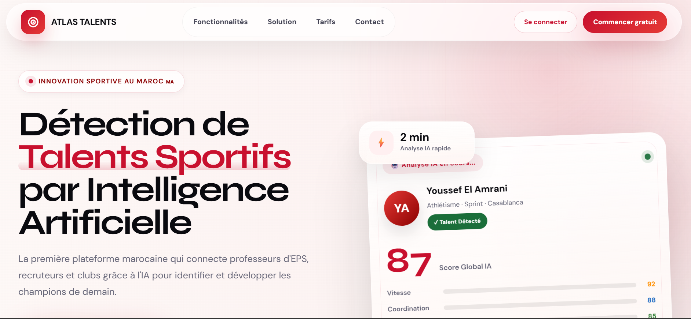

<h3>AI-assisted sports talent detection, progress tracking, and recruitment platform for Moroccan athletes.</h3>

<p>
  <strong>Detect</strong> · <strong>Analyze</strong> · <strong>Track</strong> · <strong>Recruit</strong>
</p>

<p>
  
  
  
  
</p>

</div>

---

## 📌 Table of Contents

- [Project Overview](#-project-overview)
- [Problem Statement](#-problem-statement)
- [Project Objectives](#-project-objectives)
- [Main Features](#-main-features)
- [Screenshots](#-screenshots)
  - [Landing Page](#-landing-page)
  - [Authentication](#-authentication)
  - [Teacher Space](#-teacher-space)
  - [Student Space](#-student-space)
  - [Recruitment Manager Space](#-recruitment-manager-space)
  - [Recruiter / Club Space](#-recruiter--club-space)
  - [Coach Space](#-coach-space)
- [User Roles](#-user-roles)
- [AI Video Analysis Workflow](#-ai-video-analysis-workflow)
- [Technical Architecture](#-technical-architecture)
- [Project Structure](#-project-structure)
- [Database Design](#-database-design)
- [API Overview](#-api-overview)
- [Security Features](#-security-features)
- [Installation Guide](#-installation-guide)
- [Demo Data](#-demo-data)
- [How to Use the Platform](#-how-to-use-the-platform)
- [GitHub Repository Setup](#-github-repository-setup)
- [Future Improvements](#-future-improvements)
- [Author](#-author)

---

## 📖 Project Overview

**Atlas Talents** is a complete web platform designed to support the detection, monitoring, and recruitment of young sports talents.

The platform connects multiple actors in the sports ecosystem:

- PE teachers who upload and monitor student performances
- Students who follow their personal progress
- Coaches who track athlete development
- Recruiters and clubs who discover promising talents
- Recruitment managers who coordinate scouting activity

The platform uses **AI-assisted video analysis** to generate structured performance evaluations from uploaded sports videos. These evaluations include physical scores, strengths, weaknesses, recommendations, and recruitment insights.

---

## 🎯 Problem Statement

Many young athletes have strong potential but are not visible to clubs or recruiters because there is no centralized digital system connecting schools, coaches, and recruitment teams.

Traditional scouting is often limited by:

- Geographic distance
- Lack of structured athlete data
- Manual evaluations
- Limited access to performance history
- Difficulty comparing talents across regions
- Weak communication between teachers, coaches, and clubs

**Atlas Talents** solves this by creating a digital bridge between schools, athletes, coaches, recruiters, and clubs.

---

## 🧭 Project Objectives

The main objectives of Atlas Talents are:

- Digitize sports talent detection
- Help teachers evaluate students more efficiently
- Give students access to personal progress insights
- Help coaches monitor performance evolution
- Allow recruiters to discover talents across Morocco
- Use AI to assist performance analysis
- Improve communication between all actors
- Provide dashboards adapted to each user role

---

## 🚀 Main Features

### 🤖 AI-Assisted Performance Analysis

- Upload sports performance videos
- Analyze athlete performance using AI assistance
- Generate a global score
- Evaluate multiple athletic criteria:
  - Speed
  - Coordination
  - Endurance
  - Strength
  - Flexibility
- Generate AI summary
- Identify strengths
- Detect improvement areas
- Produce recommended action plan
- Display AI confidence level

### 👥 Multi-Role Platform

Atlas Talents includes separate dashboards for:

- Student
- PE Teacher
- Coach
- Recruiter / Club
- Recruitment Manager
- Admin / Management access

### 📊 Dashboards and Statistics

- Class score overview
- Talent detection indicators
- Student progress tracking
- Recruitment priority tracking
- Geographic coverage
- Coach performance follow-up
- Recent activity feed
- Charts and score evolution

### 🔎 Recruitment Tools

- Talent discovery
- Sport-based filtering
- City-based filtering
- AI score indicators
- Priority status
- Favorites / shortlist
- Recruiter dashboard
- Export recruitment data

### 💬 Internal Messaging

- Teacher to coach communication
- Recruiter to coach communication
- Manager coordination
- Talent-related conversation context
- Message interface by role

### 🔐 Secure Platform

- Login system
- Role-based access control
- Password hashing
- CSRF protection
- Secure sessions
- Protected media access
- Private upload storage
- PDO prepared statements

---

# 📸 Screenshots

The screenshots are organized by user type and platform section.

---

## 🌍 Landing Page

The landing page presents the product, features, workflow, target users, testimonials, and pricing plans.

### 1. Hero Section


### 2. Platform Features

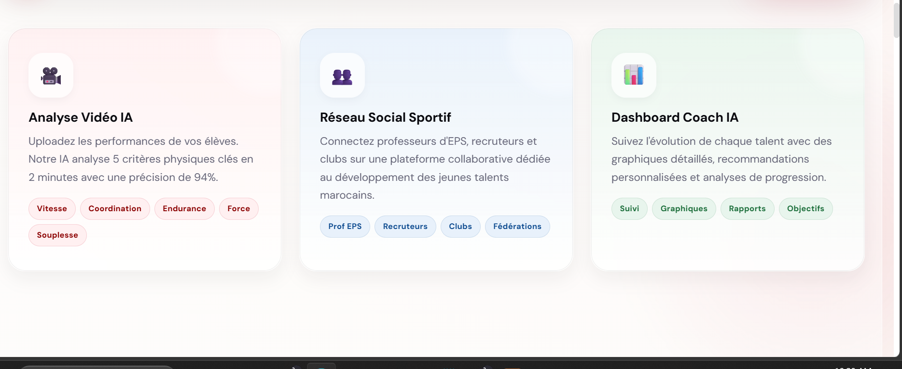

### 3. Solution Workflow

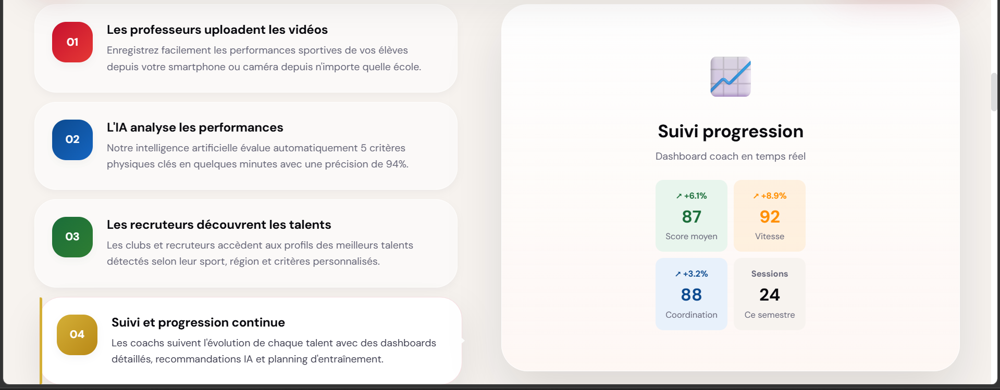

### 4. User Roles Section

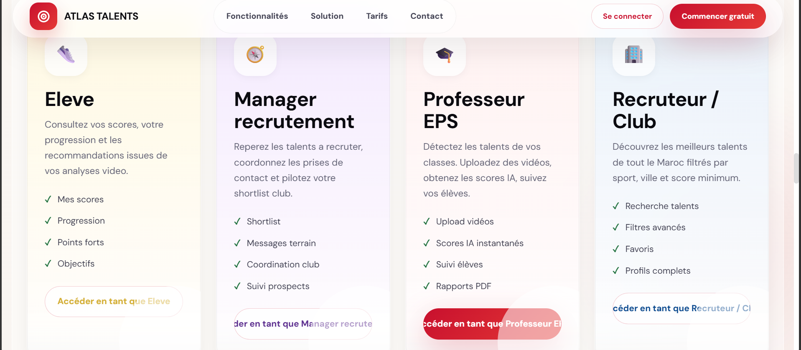

### 5. Testimonials Section

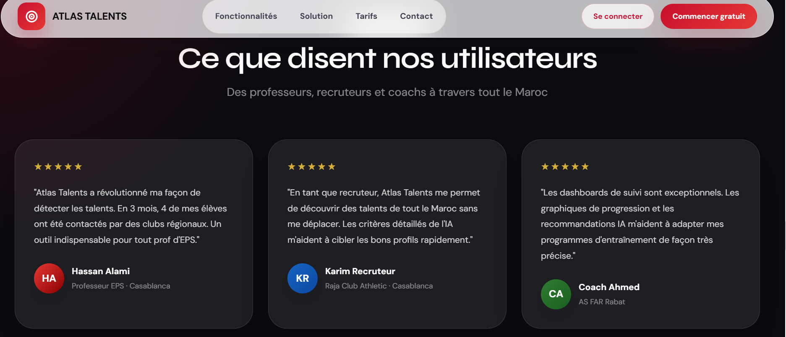

### 6. Pricing Section

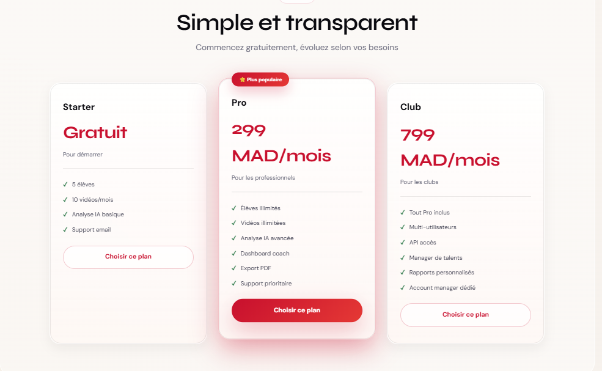

---

## 🔐 Authentication

The authentication page allows each user to connect according to their role. The platform supports multiple user profiles such as teacher, student, manager, recruiter, and coach.

### Login and Role Selection

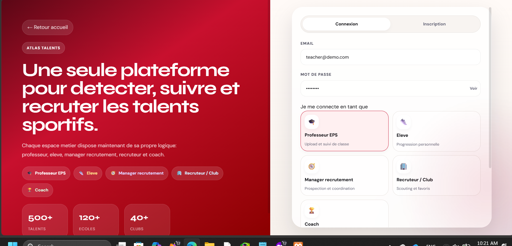

---

## 👨‍🏫 Teacher Space

The teacher space is dedicated to PE teachers. Teachers can manage students, upload performance videos, view class statistics, access AI scores, and communicate with other actors.

### Teacher Dashboard

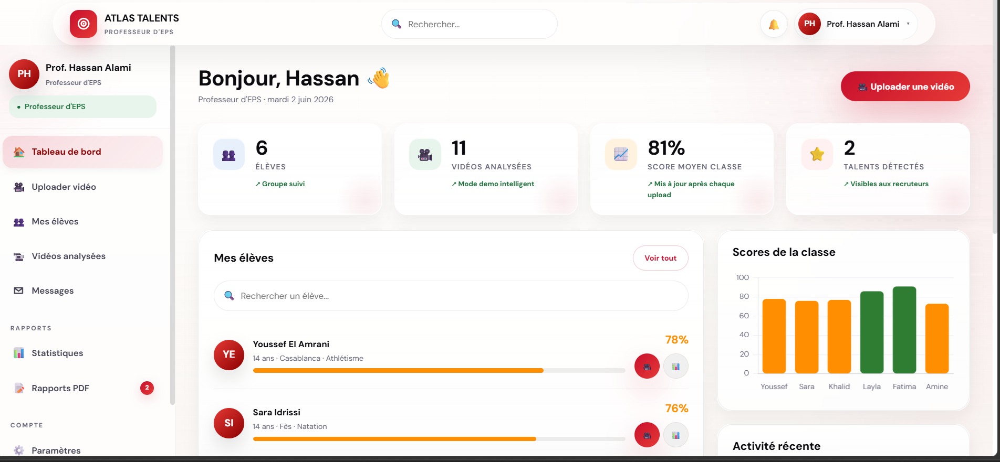

### Teacher Messaging

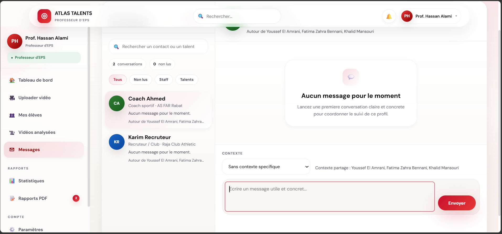

### Teacher Statistics

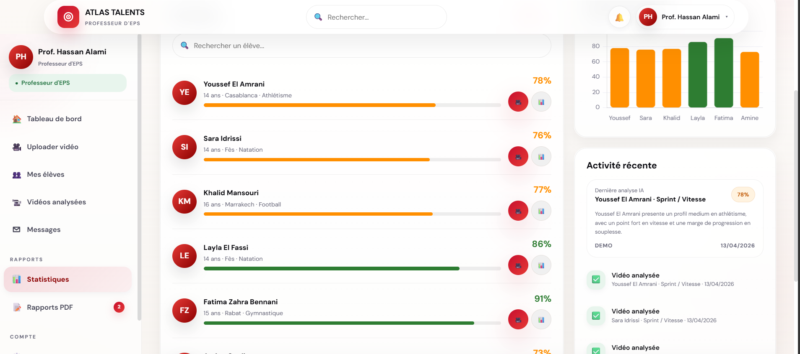

### Teacher Main Features

- View class overview
- Upload athlete videos
- Launch AI-assisted analysis
- Track number of analyzed videos
- View detected talents
- Monitor class average score
- Open student profiles
- Access statistics
- Generate/export reports
- Send messages to coaches or recruiters

---

## 👨‍🎓 Student Space

The student space allows athletes to understand their performance, follow progress, and see personalized AI recommendations.

### Student Dashboard

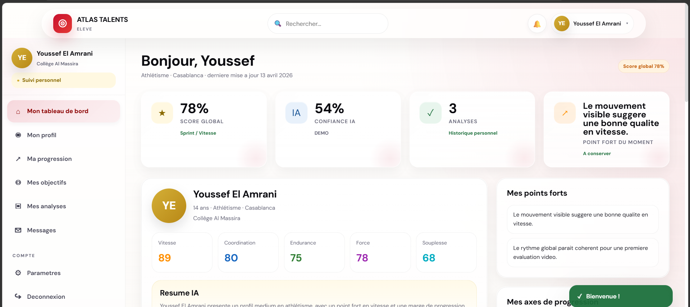

### Student AI Profile Summary

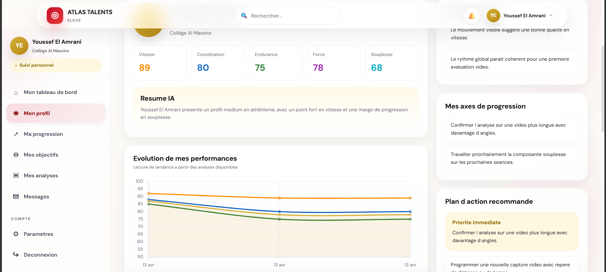

### Student Progress Analysis

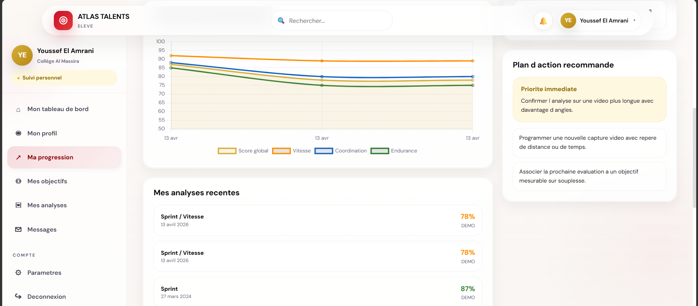

### Student Main Features

- View global AI score
- View AI confidence score
- Track personal performance
- See physical scores by category
- Read AI-generated summary
- Identify strengths
- Identify improvement areas
- Follow recommended action plan
- View recent analyses
- Access progress charts

---

## 🧑‍💼 Recruitment Manager Space

The recruitment manager dashboard gives a global overview of recruitment activity. It helps managers coordinate scouting, monitor priority talents, and evaluate geographic coverage.

### Recruitment Manager Dashboard

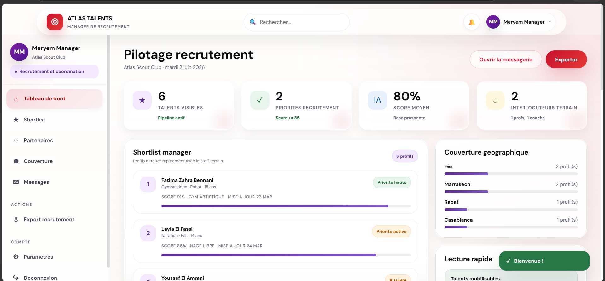

### Manager Shortlist and Coverage

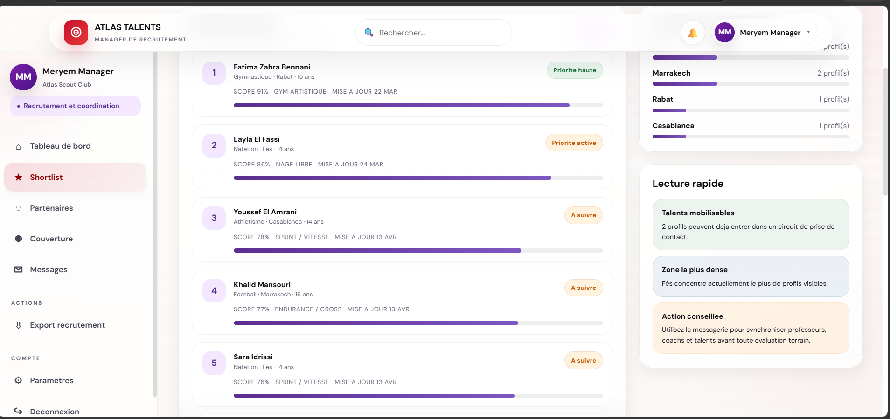

### Manager Main Features

- View visible talents
- Track priority recruitment profiles
- Monitor average talent score
- View number of field contacts
- Manage shortlist
- View city coverage
- Identify dense recruitment zones
- Coordinate with teachers, coaches, and recruiters
- Export recruitment data

---

## 🔎 Recruiter / Club Space

The recruiter dashboard allows clubs and recruiters to discover talented athletes, filter profiles, save favorites, and prepare recruitment decisions.

### Recruiter Talent Discovery

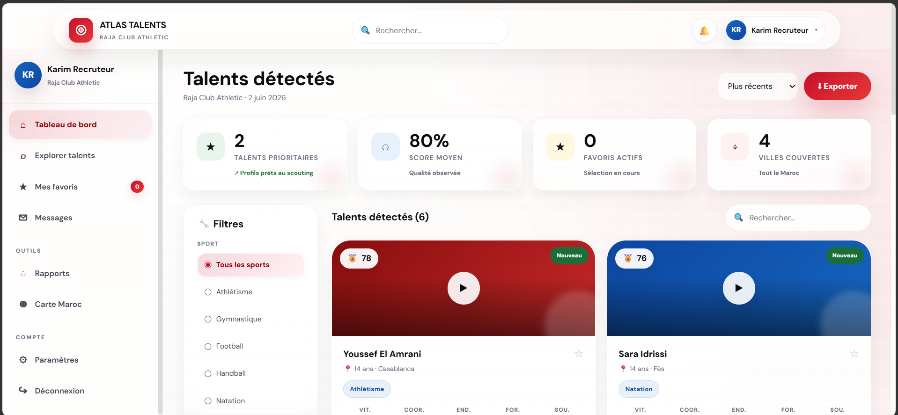

### Recruiter Main Features

- Browse detected talents
- Filter by sport
- Filter by city
- Sort by recent or priority profiles
- View AI score
- Open talent cards
- Save favorite athletes
- Access profile details
- Export data
- Communicate through messaging

---

## 🏋️ Coach Space

The coach space is designed for athlete monitoring and performance development. Coaches can follow assigned athletes, view statistics, analyze progress, and coordinate with other users.

### Coach Dashboard

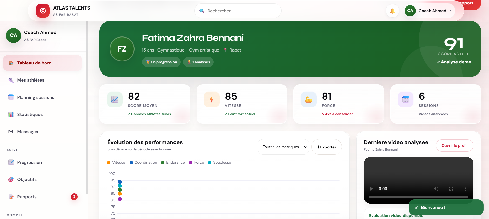

### Coach Athletes and Messaging

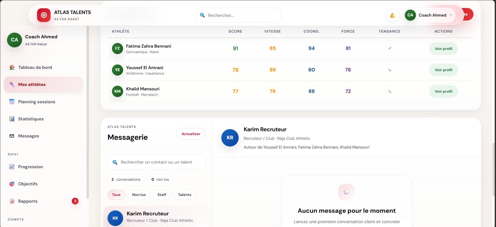

### Coach Main Features

- Monitor assigned athletes
- View current score
- Track speed, strength, and coordination
- View latest analyzed video
- Access progress charts
- Review athlete statistics
- Communicate with teachers and recruiters
- Export reports
- Follow improvement objectives

---

# 👥 User Roles

## 👨‍🏫 PE Teacher

The teacher is responsible for uploading videos and monitoring class performance.

```text
Teacher → Upload video → AI analysis → Student score → Talent visibility
```

## 👨‍🎓 Student

The student can view personal results, progress, strengths, and recommendations.

```text
Student → View score → Understand feedback → Follow progress → Improve
```

## 🏋️ Coach

The coach monitors athletes and helps them improve with targeted recommendations.

```text
Coach → Track athlete → Analyze progress → Adjust training → Communicate
```

## 🔎 Recruiter / Club

The recruiter explores detected talents and creates a shortlist of promising profiles.

```text
Recruiter → Explore talents → Filter profiles → Save favorites → Contact staff
```

## 🧑‍💼 Recruitment Manager

The manager supervises recruitment operations and coordinates scouting decisions.

```text
Manager → Monitor shortlist → Check coverage → Prioritize profiles → Export data
```

---

# 🧠 AI Video Analysis Workflow

```text
1. Teacher uploads a performance video
2. The platform stores the video securely
3. The system prepares video/frame data for analysis
4. AI-assisted analysis evaluates the athlete
5. Scores are generated for physical criteria
6. Recommendations and summaries are created
7. Results are saved in the database
8. Student, teacher, coach, and recruiter dashboards are updated
```

### Evaluated Criteria

| Criterion | Description |
|---|---|
| Speed | Evaluates quickness and sprint quality |
| Coordination | Evaluates movement control and rhythm |
| Endurance | Evaluates effort sustainability |
| Strength | Evaluates visible power and physical intensity |
| Flexibility | Evaluates mobility and movement range |
| Global Score | Combined performance indicator |

---

# 🏗️ Technical Architecture

Atlas Talents follows a classic PHP web application architecture with separated responsibilities.

```text
Browser
  ↓
PHP Pages / Dashboards
  ↓
API Layer
  ↓
Authentication + Business Logic
  ↓
PDO Database Access
  ↓
MySQL Database
```

For AI analysis:

```text
Video Upload
  ↓
Secure Storage
  ↓
AI Analysis Agent
  ↓
Structured JSON Result
  ↓
Database Save
  ↓
Dashboard Display
```

---

# 🛠️ Technologies Used

| Layer | Technology |
|---|---|
| Backend | PHP |
| Database | MySQL |
| Database Access | PDO |
| Frontend | HTML5, CSS3, JavaScript |
| UI Design | Custom responsive interface |
| Authentication | PHP Sessions |
| Security | CSRF, password hashing, RBAC |
| AI | OpenAI API / AI-assisted analysis |
| Media | Secure video upload and protected media access |
| Version Control | Git & GitHub |
| Local Server | XAMPP / WAMP / Laragon compatible |

---

# 📁 Project Structure

```text
atlas-talents/
│
├── api/
│   └── index.php
│
├── components/
│   ├── chat_panel.php
│   ├── footer.php
│   ├── head.php
│   ├── navbar.php
│   ├── scripts.php
│   └── settings_modal.php
│
├── includes/
│   ├── auth.php
│   ├── config.php
│   ├── database.php
│   ├── helpers.php
│   └── video_analysis_agent.php
│
├── pages/
│   ├── auth/
│   ├── teacher/
│   ├── student/
│   ├── manager/
│   ├── recruiter/
│   ├── coach/
│   └── admin/
│
├── public/
│   ├── css/
│   └── uploads/
│
├── storage/
│   ├── private/
│   └── uploads/
│
├── screenshots/
│   ├── 01-landing-hero.png
│   ├── 02-landing-features.png
│   ├── 03-landing-solution-workflow.png
│   ├── 04-landing-user-roles.png
│   ├── 05-landing-testimonials.png
│   ├── 06-landing-pricing.png
│   ├── 07-auth-login-and-role-selection.png
│   ├── 08-teacher-dashboard.png
│   ├── 09-teacher-messaging.png
│   ├── 10-teacher-statistics.png
│   ├── 11-student-dashboard.png
│   ├── 12-student-profile-ai-summary.png
│   ├── 13-student-progress-analysis.png
│   ├── 14-manager-recruitment-dashboard.png
│   ├── 15-manager-shortlist-and-coverage.png
│   ├── 16-recruiter-talents-detected.png
│   ├── 17-coach-dashboard.png
│   └── 18-coach-athletes-and-messaging.png
│
├── index.php
├── media.php
├── schema.sql
├── seed_demo.sql
├── README.md
└── .gitignore
```

---

# 🗄️ Database Design

The database schema is located in:

```text
schema.sql
```

Demo data is located in:

```text
seed_demo.sql
```

## Main Tables

| Table | Purpose |
|---|---|
| `users` | Stores all platform accounts and roles |
| `students` | Stores athlete/student profiles |
| `videos` | Stores uploaded videos and AI analysis results |
| `favorites` | Stores recruiter favorite talents |
| `coach_students` | Links coaches to assigned students |
| `messages` | Stores internal platform messages |
| `notifications` | Stores user notifications |

## Database Relationships

```text
users 1 ─── n students
users 1 ─── n messages
students 1 ─── n videos
students 1 ─── n favorites
students n ─── n coaches through coach_students
```

---

# 📡 API Overview

The internal API is located in:

```text
api/index.php
```

It handles dynamic platform actions such as:

- Dashboard statistics
- Student data retrieval
- Progress data
- Favorite toggling
- Messaging bootstrap
- Message sending
- Message reading
- Video upload
- AI analysis request handling

## Example API Responsibilities

| API Feature | Purpose |
|---|---|
| `students` | Returns student/talent data |
| `progress` | Returns progress history |
| `stats` | Returns dashboard statistics |
| `favorites` | Returns saved recruiter talents |
| `favorite_toggle` | Adds/removes a favorite talent |
| `chat_send` | Sends an internal message |
| `upload_video` | Uploads a performance video |

---

# 🔐 Security Features

Atlas Talents includes several security practices:

- Password hashing with PHP secure password functions
- Login sessions
- Session regeneration after login
- Role-based authorization
- CSRF token protection
- PDO prepared statements
- Private video storage
- Protected media access through `media.php`
- Upload restrictions
- `.gitignore` protection for sensitive files

## Recommended Production Security

Before deploying publicly, configure:

- HTTPS
- Strong database credentials
- Hidden environment variables
- Disabled debug errors
- Upload size limits
- Login rate limiting
- Email verification
- Password reset system
- Server-level access restrictions

---

# ⚙️ Installation Guide

## 1. Requirements

Make sure you have:

- PHP 8.x or later
- MySQL 8.x or MariaDB
- Apache server
- XAMPP, WAMP, or Laragon
- Git
- Web browser

---

## 2. Clone the Repository

```bash
git clone https://github.com/asfouri/atlas-talents-ai-sports-platform.git
```

```bash
cd atlas-talents-ai-sports-platform
```

---

## 3. Move the Project to Your Local Server

For XAMPP, place the project in:

```text
C:/xampp/htdocs/
```

Example:

```text
C:/xampp/htdocs/atlas-talents-ai-sports-platform
```

---

## 4. Start Apache and MySQL

Open XAMPP Control Panel and start:

```text
Apache
MySQL
```

---

## 5. Create the Database

Open phpMyAdmin:

```text
http://localhost/phpmyadmin
```

Create a database:

```sql
CREATE DATABASE atlas_talents CHARACTER SET utf8mb4 COLLATE utf8mb4_unicode_ci;
```

---

## 6. Import SQL Files

Import the database structure:

```text
schema.sql
```

Then optionally import demo data:

```text
seed_demo.sql
```

---

## 7. Configure the Application

Open:

```text
includes/config.php
```

Update your local database information if needed:

```php
$host = 'localhost';
$dbname = 'atlas_talents';
$username = 'root';
$password = '';
```

Depending on your version, configuration may also use environment variables.

---

## 8. Open the Platform

Open in your browser:

```text
http://localhost/atlas-talents-ai-sports-platform/
```

---

# 🔑 Demo Data

Demo data can be imported from:

```text
seed_demo.sql
```

The platform includes example users for different roles:

| Role | Purpose |
|---|---|
| Teacher | Upload videos and manage students |
| Student | View personal scores and progress |
| Coach | Track assigned athletes |
| Recruiter | Discover and save talents |
| Manager | Coordinate recruitment |

> Add the exact demo emails and passwords here if you want visitors to test the project directly.

Example format:

```text
Teacher: teacher@demo.com / password
Student: student@demo.com / password
Recruiter: recruiter@demo.com / password
Coach: coach@demo.com / password
Manager: manager@demo.com / password
```

---

# 🧪 How to Use the Platform

## For Teachers

1. Login as a teacher
2. Open the dashboard
3. Upload a student performance video
4. Wait for AI-assisted analysis
5. View generated score and recommendations
6. Monitor class statistics
7. Communicate with coaches or recruiters

## For Students

1. Login as a student
2. View personal dashboard
3. Check global score
4. Read AI feedback
5. Follow progress charts
6. Apply recommended action plan

## For Recruiters

1. Login as recruiter or club
2. Open talent discovery dashboard
3. Filter talents by sport or city
4. View AI score and profile cards
5. Save favorite talents
6. Contact staff for follow-up

## For Coaches

1. Login as coach
2. View assigned athletes
3. Open athlete profile
4. Check progress and latest analysis
5. Use AI recommendations for training follow-up
6. Coordinate using messages

## For Managers

1. Login as recruitment manager
2. View recruitment dashboard
3. Check priority profiles
4. Monitor geographic coverage
5. Follow shortlist
6. Export recruitment data

---

# 🧾 GitHub Repository Setup

## Recommended Repository Name

```text
atlas-talents-ai-sports-platform
```

## Recommended GitHub Description

```text
AI-assisted sports talent detection platform built with PHP, MySQL, and OpenAI video analysis.
```

## Recommended GitHub Topics

```text
php
mysql
openai
ai
sports-tech
talent-detection
video-analysis
recruitment-platform
dashboard
pdo
role-based-access-control
web-application
```

---

# 🚀 Push to GitHub

```bash
git init
git add .
git commit -m "Initial commit - Atlas Talents platform"
git branch -M main
git remote add origin https://github.com/asfouri/atlas-talents-ai-sports-platform.git
git push -u origin main
```

If the remote already exists:

```bash
git remote set-url origin https://github.com/asfouri/atlas-talents-ai-sports-platform.git
git push -u origin main
```

---

# 📌 Current Limitations

This project is already functional as a portfolio platform, but some improvements can still be added:

- Admin dashboard can be expanded further
- Email verification is not yet fully implemented
- Password reset system can be added
- Login rate limiting can be improved
- AI analysis can be expanded with deeper computer vision processing
- Cloud video storage can be added
- Real-time notifications can be added

---

# 🔮 Future Improvements

- Full admin panel
- Email verification
- Forgot password system
- Advanced recruiter filters
- Real-time chat notifications
- PDF report generation
- Athlete certificate generation
- Cloud video upload
- Mobile app version
- Multilingual interface: French, Arabic, English
- Advanced AI comparison between athletes
- Public athlete profile sharing
- Coach training plan generator
- Federation-level dashboard

---

# 🎓 Skills Demonstrated

This project demonstrates practical skills in:

- Full-stack web development
- PHP backend development
- MySQL database design
- PDO database access
- Authentication systems
- Role-based access control
- Secure file upload
- AI API integration
- Dashboard design
- Data visualization
- Internal messaging
- Recruitment workflow modeling
- UX/UI design
- Git/GitHub project organization

---

# 👨‍💻 Author

Developed by **Ahmad Asfouri**

Computer Science Engineering Student passionate about:

- Artificial Intelligence
- Web Development
- Cybersecurity
- Sports Technology
- Digital Platforms

---

# 📄 License

This project is created for educational and portfolio purposes.

You may add an MIT License if you want the project to be open-source.

---

<div align="center">

## 🏆 Atlas Talents

### Detect. Track. Improve. Recruit.

**AI-assisted sports talent detection platform for the next generation of Moroccan athletes.**


</div>
